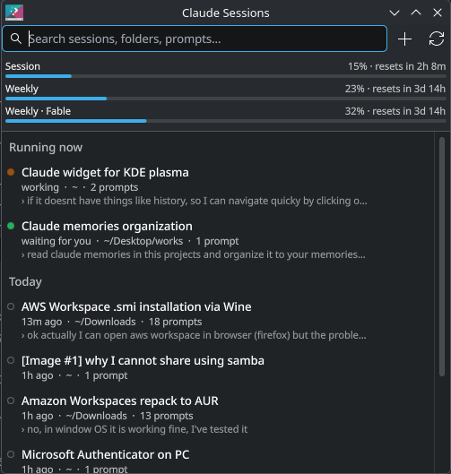
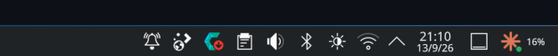

# Claude Sessions (KDE Plasma 6 widget)

A panel widget that lists your recent Claude Code sessions so you can jump back into one with a click.



In the panel: the icon gets a green badge when a session is waiting for you, next to your current session usage.



- **Session history** from `~/.claude/projects`: title (your `/rename`, else Claude's auto title, else first prompt), project folder, git branch, prompt count, last prompt. Grouped into Running now / Today / Yesterday / This week / Older. Searchable.
- **Click to continue.** A running session gets its terminal window raised (via a KWin script) instead of being resumed twice. A closed session opens a terminal in its project folder running `claude --resume <id>`.
- **Live status** from `~/.claude/sessions`: a pulsing dot while Claude is working, a green dot when it is waiting for you. The panel icon shows a green badge when any session is waiting.
- **Plan usage**: session and weekly limits with reset countdowns, using the same endpoint as `/usage` and the login Claude Code already stores. Session % is shown next to the panel icon.
- **New session** in a recent project or any folder (`+` button).
- Middle-click the panel icon to resume the most recent session.
- Keyboard: type to search, ↓ to move into the list, Enter to open.

## Install

```sh
./install.sh
```

Then right-click the panel → *Add or Manage Widgets* → *Claude Sessions*.

After editing the code, run `./install.sh` again and `systemctl --user restart plasma-plasmashell`.
To try it in a window without touching the panel: `plasmawindowed com.github.khangzxrr.claudesessions`.

## Settings

- **Terminal**: *Automatic* uses the terminal your running Claude sessions live in, then KDE's default terminal, then the first one installed. A custom command can use `{cwd}` and `{cmd}`, e.g. `foot -D {cwd} {cmd}`.
- Keep a shell open after Claude exits, usage refresh interval, session rescan interval, number of sessions listed.

## How it works

`package/contents/code/backend.py` (Python 3, stdlib only) does the work and prints JSON; the QML UI calls it through Plasma's executable data engine.

```sh
python3 package/contents/code/backend.py list
python3 package/contents/code/backend.py usage --max-age 0
python3 package/contents/code/backend.py open <session-id> --dry-run
```

Transcripts are indexed by mtime/size in `~/.cache/claude-sessions-plasmoid/`, so rescans only re-read files that changed. Usage is cached on disk and fetched at most once per interval to stay clear of the endpoint's rate limit.
